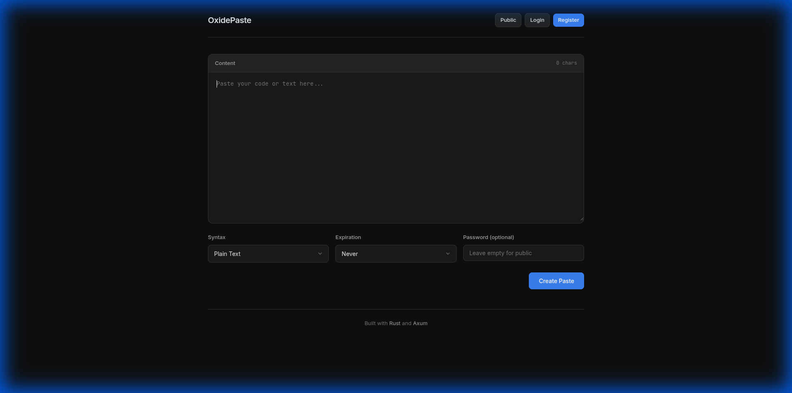
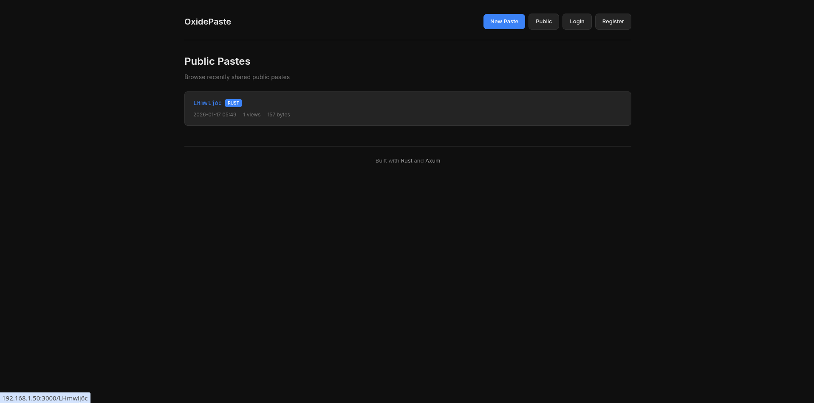
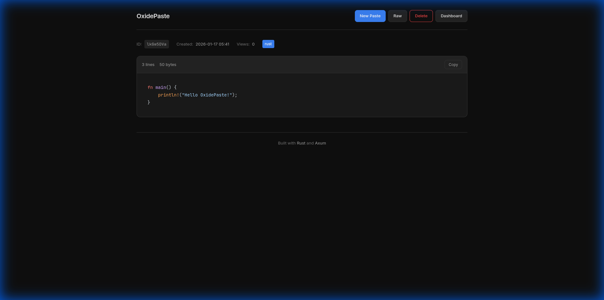

# OxidePaste

A fast, secure, and lightweight pastebin service built with Rust.

## Screenshots

### Homepage



### Public Pastes



### Dashboard (User History)


### Code View (Syntax Highlighting)



## Features

- Fast and lightweight (single binary, ~5MB)
- Password-protected pastes
- Expiration support
- Syntax highlighting for 20+ languages
- User accounts with paste history
- Public paste browser
- Cross-platform (Linux, Windows, macOS, Termux)

## Quick Start

### Download Binary

Download the pre-built binary for your platform from the [Releases](https://github.com/sirayu-pn/OxidePaste/releases) page:

| Platform       | Architecture  | Download                         |
| -------------- | ------------- | -------------------------------- |
| Linux          | x86_64        | `oxide-paste-linux-x86_64`       |
| Linux          | ARM64         | `oxide-paste-linux-arm64`        |
| Linux (static) | x86_64        | `oxide-paste-linux-x86_64-musl`  |
| Linux (static) | ARM64         | `oxide-paste-linux-arm64-musl`   |
| Windows        | x86_64        | `oxide-paste-windows-x86_64.exe` |
| Windows        | ARM64         | `oxide-paste-windows-arm64.exe`  |
| macOS          | x86_64        | `oxide-paste-macos-x86_64`       |
| macOS          | Apple Silicon | `oxide-paste-macos-arm64`        |

### Run

```bash
# Linux/macOS
chmod +x oxide-paste-*
./oxide-paste-linux-x86_64

# Windows
oxide-paste-windows-x86_64.exe
```

The server will start at `http://0.0.0.0:3000`

## Building from Source

### Prerequisites

- Rust 1.70+ (https://rustup.rs)

### Build

```bash
# Clone the repository
git clone https://github.com/sirayu-pn/OxidePaste.git
cd oxide-paste

# Build release binary
cargo build --release

# Run
./target/release/oxide-paste
```

### Cross-Compilation

#### For ARM64 (Raspberry Pi, Android)

```bash
# Install cross-compilation toolchain
rustup target add aarch64-unknown-linux-gnu

# On Ubuntu/Debian
sudo apt-get install gcc-aarch64-linux-gnu

# Build
cargo build --release --target aarch64-unknown-linux-gnu
```

#### For Windows (from Linux)

```bash
# Install cross-compilation toolchain
rustup target add x86_64-pc-windows-gnu
sudo apt-get install mingw-w64

# Build
cargo build --release --target x86_64-pc-windows-gnu
```

## Termux (Android)

### Install using pkg

```bash
# Install Rust
pkg install rust

# Clone and build
git clone https://github.com/sirayu-pn/OxidePaste.git
cd oxide-paste
cargo build --release

# Run
./target/release/oxide-paste
```

### Using Pre-built Binary

```bash
# Download ARM64 binary
curl -LO https://github.com/sirayu-pn/OxidePaste/releases/latest/download/oxide-paste-linux-arm64-musl
chmod +x oxide-paste-linux-arm64-musl
./oxide-paste-linux-arm64-musl
```

## Configuration

### Environment Variables

| Variable       | Default                            | Description          |
| -------------- | ---------------------------------- | -------------------- |
| `DATABASE_URL` | `sqlite:./oxide-paste.db?mode=rwc` | SQLite database path |
| `PORT`         | `3000`                             | Server port          |

### Example

```bash
# Custom database location
DATABASE_URL=sqlite:/data/pastes.db ./oxide-paste

# Custom port (requires code change)
# Edit src/main.rs line with SocketAddr
```

## Docker

```dockerfile
FROM rust:1.75-alpine AS builder
WORKDIR /app
COPY . .
RUN apk add --no-cache musl-dev
RUN cargo build --release

FROM alpine:latest
WORKDIR /app
COPY --from=builder /app/target/release/oxide-paste .
EXPOSE 3000
CMD ["./oxide-paste"]
```

Build and run:

```bash
docker build -t oxide-paste .
docker run -p 3000:3000 -v $(pwd)/data:/app oxide-paste
```

## API

### Create Paste

```bash
curl -X POST http://localhost:3000 \
  -d "content=Hello World" \
  -d "language=plaintext" \
  -d "expiration=1h"
```

### View Paste (Raw)

```bash
curl http://localhost:3000/PASTE_ID/raw
```

## License

MIT License
